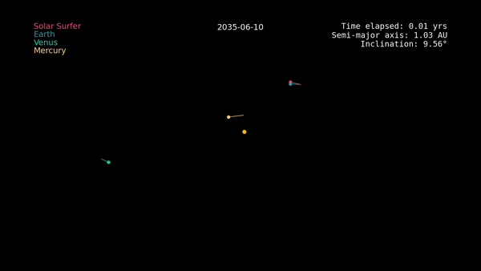
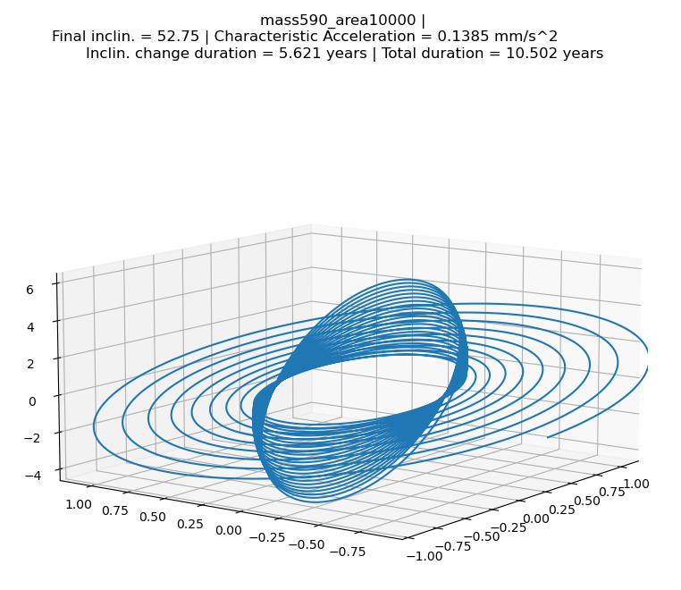
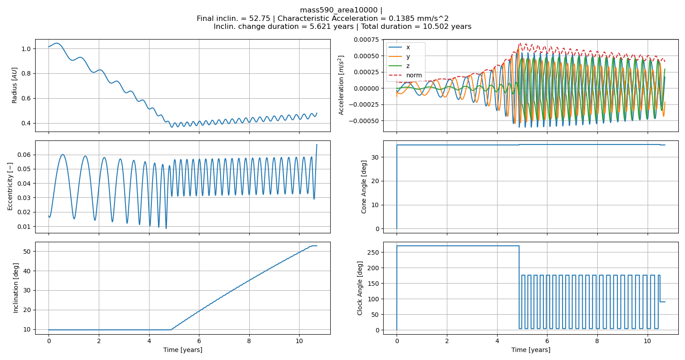

# Solar Surfer Models
This repository contains models created for a Solar Sail mission to the poles of the sun, dubbed *Solar Surfer*, as part of the TU Delft Master's project "Collaborative Space Systems Design (CSDP)".

The project took place between February and April 2023.
## Models
### Thermal Model
**Add text**
### Orbital Model
The largest portion of the repository consists of a orbital model based in Tudat. It includes simplified solar sail physics and guidance model to parametrically generate trajectories to the sun. Some aspects of the model involve optimisation using PyGMO. The thermal model is fully integrated and can optionally be turned on or off.
#### Relevant Files
The most important files are given in bold.
- simulation/
  - **simulationV1.py** | Runs the simulation using the guidance model for thrust control. Also contains methods for plotting and simulating the movement of the planets
  - **pygmoOptV1.py** | Contains the sail optimise class which implements a PyGMO User Defined Problem (UDP) used in optimisation scripts.
- solarsail/
  - base.py | Base class of the solar sail guidance model. Notably contains the thrust direction and magnitude interfaces used in the simulation by Tudat.
  - sailPhysicalV3.py | Extends the base class to calculate properties of the sail including thrust and orientation based on orbital parameters. This is where the magic happens. This version includes fast transfers with multiple in and out dips and many quality of life and interfacing options including integration of the thermal model.
  - **sailPhysicalV3_opt.py** | A simplified version of the above using a single dip, tailored for use in the final optimisation.
  - sailPhysicalV2_2.py | A refurbished version of the old guidance model without fast transfers.
  - transform.py | Contains the coordinate system transform between sail and inertial.
- runSimV1Thermal.py | runs the simulation with thermal model
- **runPygmoOptimise.py** | optimises the fast transfer using pygmo the file used for final results
- runSimV1FastExample.py | produces a quick example.
### Launch and Gravity Assist scripts
The folder *Gravity Assist and Launch Parameters* contains scripts in matlab to analyse optimal launches and gravity assists. Its used to find initial parameters for the simulation runs.
#### Relevant Files
- Gravity Assist and Launch Parameters/
  - **ExcessVelocity.m** | analysis for optimal launch excess velocity vector and launch date.
  - lambert_venus.m | analysis of a later discarded venus gravity assist.
### ADCS Models
**Add text**
### Install:
The ADCS and GA/Launch scripts can be accessed directly using Matlab. For the thermal and orbital models the following install steps can be used:
1. Clone Repository
   ```
   git clone git@github.com:tristandijkstra/PolarSolarSail.git
   ```
2. Download and install miniconda: https://docs.conda.io/en/latest/miniconda.html
3. Set up conda with the following commands:
   ```
   conda config --add channels conda-forge
   conda config --set channel_priority strict
   cd PolarSolarSail
   conda env create -f environment.yaml
   ```
4. Activate the environment 'tudat-space-pygmo'
5. Run relevant files
## Example Results

### Orbital outputs
The animation is generated using [this trajectory animator](https://github.com/tristandijkstra/TrajectoryAnimator).


