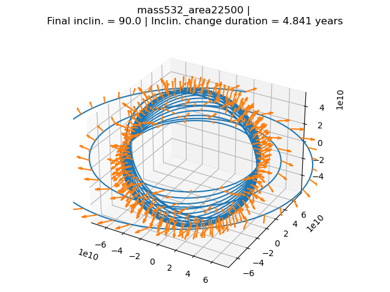

# PolarSolarSail
CSDP - Solar sail orbit model

### Files relevant for CDR:
- solarsail/base.py
- solarsail/sailPhysicialV1.py
- simulation/simulationV0.py
- runSimV0.py

### Install:

1. Clone Repository
```
git clone git@github.com:tristandijkstra/PolarSolarSail.git
```
2. Download and install miniconda: https://docs.conda.io/en/latest/miniconda.html
3. Set up conda with the following commands:
   ```
   conda config --add channels conda-forge
   conda config --set channel_priority strict
   cd PolarSolarSail
   conda env create -f environment.yaml
   ```
4. Run ```runSimV0.py```

### Example:

